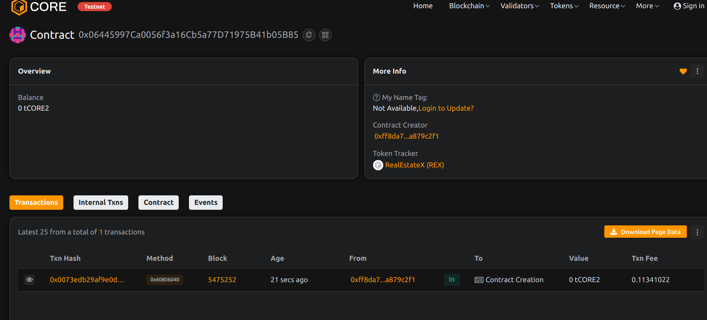

# RealEstateX: Tokenized Real Estate Ownership and Transfer

## Project Description
RealEstateX transforms physical properties into tradable digital assets using blockchain technology. It enables fractional ownership, transparent valuation, and seamless transfer of real estate assets through NFT tokens.

## Project Vision
To democratize real estate investment by:
- Enabling fractional property ownership
- Creating liquid markets for illiquid assets
- Providing transparent valuation records
- Reducing transaction friction
- Globalizing property investment

## Key Features
- NFT-based property representation
- Fractional ownership tracking
- Multi-owner support
- Professional valuation system
- Geolocation verification
- Legal description anchoring

## Future Scope
- Rental income distribution
- Property management DAOs
- Cross-chain interoperability
- Mortgage tokenization
- Insurance integration

## Contract Details
0x06445997Ca0056f3a16Cb5a77D71975B41b05B85
